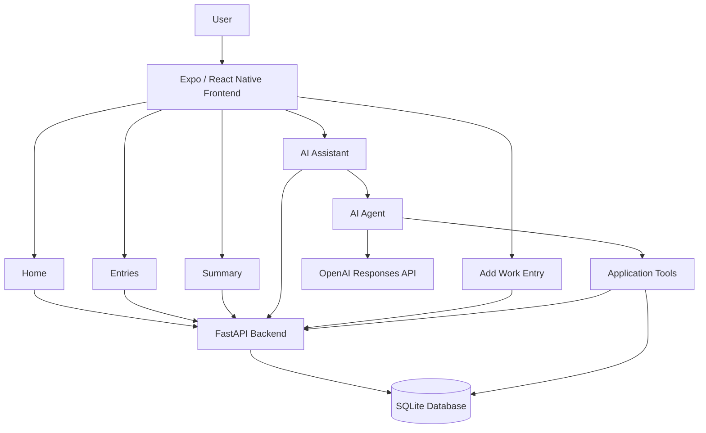

# Work Hour Tracker

A full-stack work-hours and earnings tracking application built with **React Native / Expo**, **FastAPI**, **SQLite**, and an **OpenAI-powered AI assistant**.

Work Hour Tracker allows users to record working hours and hourly rates, review their work history, generate earnings summaries for a date range, and interact with an AI assistant that can work with their records through application tools.

> **Project status:** Functional MVP / portfolio project — currently being refined for production-readiness and public release.

---

## Overview

Tracking work hours manually can make it difficult to calculate earnings, review historical records, and quickly answer questions about work performed over a period of time.

Work Hour Tracker provides a simple interface for:

- Recording work hours and hourly pay rates
- Viewing saved work entries
- Calculating total hours and earnings over a selected date range
- Asking an AI assistant questions about work records
- Allowing the AI assistant to perform supported record-management operations

The application is designed as a practical demonstration of full-stack application development, API design, database integration, mobile/web development, and AI tool calling.

---

## Key Features

### Work Entry Management

- Add a work entry with:
  - Work date
  - Hours worked
  - Hourly rate
- Validate hours and hourly rate before submission
- Store records in a SQLite database
- Prevent duplicate entries for the same date under the current data model
- Update an existing entry by date

### Work History

- Retrieve all saved work entries
- Display hours worked, hourly rate, and calculated earnings for each entry

### Earnings Summary

- Select a start date and end date
- Calculate:
  - Total hours worked
  - Total earnings
- Validate that the start date is not after the end date
- Display calculated values to two decimal places

### AI Assistant

The application includes an AI assistant connected to the backend.

The assistant can:

- Answer general questions conversationally
- Retrieve work records
- Retrieve a specific record by date
- Generate summaries for date ranges
- Save work entries
- Update existing work entries

The AI assistant uses function/tool calling to connect natural-language requests with application functionality.

For example:

> "How many hours did I work this month?"

or:

> "Record 8 hours today at $15 per hour."

The assistant can interpret the request and use the appropriate backend operation.

---

## Application Architecture



### Request Flow

A typical work-entry request follows this path:

```text
User
  ↓
Expo / React Native UI
  ↓
Frontend API Service
  ↓
FastAPI Endpoint
  ↓
Service Layer
  ↓
SQLite Database
```

For an AI request:

```text
User
  ↓
AI Assistant UI
  ↓
POST /agent
  ↓
AI Agent
  ↓
OpenAI model
  ↓
Tool selection
  ↓
Application service
  ↓
SQLite Database
  ↓
Tool result
  ↓
AI-generated response
  ↓
User
```

---

## Technology Stack

### Frontend

- **React Native**
- **Expo**
- **Expo Router**
- **TypeScript**
- **React Navigation**
- **@react-native-community/datetimepicker**

The frontend supports both native navigation and a web-specific tab interface.

### Backend

- **Python**
- **FastAPI**
- **Uvicorn**
- **Pydantic**
- **SQLite**

### Artificial Intelligence

- **OpenAI API**
- **Responses API**
- **Function/tool calling**
- **GPT-4o-mini**

### Database

- **SQLite**

The current database contains a `work_entries` table with:

| Column | Type | Description |
|---|---|---|
| `id` | INTEGER | Primary key |
| `date` | TEXT | Date the work was performed |
| `hours_worked` | REAL | Number of hours worked |
| `hourly_rate` | REAL | Hourly pay rate |

---

## Project Structure

```text
work-hour-tracker/
│
├── backend/
│   └── app/
│       ├── ai.py
│       ├── config.py
│       ├── database.py
│       ├── main.py
│       ├── models.py
│       ├── schemas.py
│       ├── tools.py
│       │
│       ├── services/
│       │   └── entry.py
│       │
│       └── tests/
│           ├── test_agent.py
│           ├── test_db.py
│           ├── test_insert.py
│           ├── test_retrieve.py
│           └── test_tables.py
│
├── frontend/
│   ├── src/
│   │   ├── app/
│   │   │   ├── (tabs)/
│   │   │   │   ├── index.tsx
│   │   │   │   ├── entries.tsx
│   │   │   │   ├── summary.tsx
│   │   │   │   ├── assistant.tsx
│   │   │   │   └── _layout.tsx
│   │   │   │
│   │   │   ├── add-entry.tsx
│   │   │   └── _layout.tsx
│   │   │
│   │   ├── components/
│   │   ├── constants/
│   │   ├── hooks/
│   │   └── services/
│   │       └── api.ts
│   │
│   ├── app.json
│   ├── package.json
│   └── tsconfig.json
│
├── requirements.txt
├── .gitignore
└── README.md
```

---

# Getting Started

## Prerequisites

Before running the application locally, install:

- Python 3.12+
- Node.js and npm
- Expo-compatible development environment
- An OpenAI API key for AI assistant functionality

---

## 1. Clone the Repository

```bash
git clone https://github.com/Emmanuel-K0ech/work-hour-tracker.git
cd work-hour-tracker
```

---

## 2. Backend Setup

Create and activate a Python virtual environment:

### Linux / macOS

```bash
python3 -m venv venv
source venv/bin/activate
```

### Windows

```powershell
python -m venv venv
venv\Scripts\activate
```

Install the backend dependencies:

```bash
pip install -r requirements.txt
```

The current backend also imports the OpenAI SDK and `python-dotenv`. If they are not included in the environment created from `requirements.txt`, install them with:

```bash
pip install openai python-dotenv
```

### Configure the OpenAI API key

Create a local environment file at:

```text
backend/app/.env
```

Add:

```env
OPENAI_API_KEY=your_api_key_here
```

**Never commit this file or your actual API key to GitHub.**

Start the FastAPI server from the project root:

```bash
uvicorn app.main:app --reload
```

If running the command from the `backend` directory instead:

```bash
cd backend
uvicorn app.main:app --reload
```

The API will normally be available at:

```text
http://localhost:8000
```

---

## 3. Frontend Setup

Open another terminal:

```bash
cd frontend
```

Install JavaScript dependencies:

```bash
npm install
```

Start Expo:

```bash
npx expo start
```

### Run on the Web

```bash
npx expo start --web
```

### Run on Android

```bash
npx expo start --android
```

### Run on iOS

```bash
npx expo start --ios
```

The native commands require the appropriate Android/iOS development environment.

---

## Important: Backend URL

The frontend currently uses:

```text
http://localhost:8000
```

for backend requests.

This works when the frontend and backend are running on the same machine.

For a physical phone or a deployed environment, `localhost` refers to the device itself rather than the computer running FastAPI. The API URL should therefore be changed to a reachable backend address before using the application outside the local development environment.

A future improvement should move this URL into an environment-based configuration.

---

# API Documentation

The backend exposes the following endpoints.

## Create Work Entry

```http
POST /entries
```

Example request:

```json
{
  "date": "2026-09-02",
  "hours_worked": 8,
  "hourly_rate": 15
}
```

---

## Retrieve All Entries

```http
GET /entries
```

Returns the saved work entries.

---

## Retrieve an Entry by Date

```http
GET /entries/{date}
```

Example:

```http
GET /entries/2026-09-02
```

---

## Generate Work Summary

```http
GET /summary?start_date=YYYY-MM-DD&end_date=YYYY-MM-DD
```

Example:

```http
GET /summary?start_date=2026-09-01&end_date=2026-09-30
```

The response includes total hours and total earnings for the selected period.

---

## Update an Entry

```http
PUT /entries/{date}
```

Example:

```http
PUT /entries/2026-09-02
```

Request body:

```json
{
  "hours_worked": 10,
  "hourly_rate": 15
}
```

---

## AI Assistant

```http
POST /agent
```

Example request:

```json
{
  "message": "How many hours did I work this month?"
}
```

The endpoint sends the request to the AI agent, which determines whether an application tool is required.

---

# AI Assistant Architecture

The AI assistant is implemented as a backend service rather than calling OpenAI directly from the frontend.

This keeps the API key on the server and allows the application to control which operations the model can perform.

The currently available tools are:

| Tool | Purpose |
|---|---|
| `save_entry` | Save a new work entry |
| `get_entries` | Retrieve all work entries |
| `get_entry` | Retrieve an entry by date |
| `update_entry` | Update an existing entry |
| `get_summary` | Calculate hours and earnings for a date range |

### Tool Calling Flow

```text
1. User sends a natural-language request
                ↓
2. Backend sends request to OpenAI
                ↓
3. Model determines whether a tool is required
                ↓
4. Backend extracts the requested tool and arguments
                ↓
5. Backend executes the application function
                ↓
6. Tool result is returned to the AI
                ↓
7. AI generates a natural-language response
                ↓
8. Response is returned to the frontend
```

This architecture demonstrates an important pattern for AI-enabled applications: the model handles language understanding while the application remains responsible for executing actual operations against its data.

---

# Database

The application currently uses SQLite for local persistence.

The database is created automatically when the backend initializes the application.

The current schema is:

```sql
CREATE TABLE IF NOT EXISTS work_entries (
    id INTEGER PRIMARY KEY AUTOINCREMENT,
    date TEXT NOT NULL,
    hours_worked REAL NOT NULL,
    hourly_rate REAL NOT NULL
);
```

### Current Data Model Limitation

The current service layer prevents more than one work entry from being saved for the same date.

This means the application currently models:

```text
One date → One work entry
```

A future version may change this to:

```text
One date → Multiple work entries
```

This would support scenarios such as multiple shifts in one day or different hourly rates during the same day.

---

# Testing

The repository includes backend test scripts covering areas such as:

- Database initialization
- Table creation
- Database insertion
- Record retrieval
- AI agent behavior

The test files are located under:

```text
backend/app/tests/
```

Current tests are primarily lightweight Python scripts and should be expanded into a formal automated test suite before production deployment.

A future testing setup should include:

- `pytest`
- API endpoint tests
- Database service tests
- AI tool-calling tests
- Frontend component tests
- End-to-end tests

---

# Security Considerations

This project is currently designed for local development and portfolio demonstration.

Before production deployment, the following should be addressed:

### API Key Protection

Never commit:

```text
.env
```

or an actual OpenAI API key.

The API key should remain exclusively on the backend.

### CORS

The current backend allows all origins during development:

```python
allow_origins=["*"]
```

Production deployment should restrict this to trusted frontend origins.

### Input Validation

The application performs basic frontend validation. Backend validation should also enforce sensible constraints such as:

- Positive hours worked
- Positive hourly rate
- Valid date format
- Reasonable numeric ranges

### Database

The SQLite database is appropriate for the current local MVP.

A production application should consider a managed relational database and proper user isolation if multiple users are supported.

### Authentication

The current application does not implement user authentication or authorization.

Before supporting multiple users, authentication and authorization should be added so that users can only access their own records.

---

# Known Limitations

The current MVP has several areas that are intentionally left for future development:

- No user authentication
- SQLite is intended for local development
- Frontend API URL is currently hardcoded
- Home dashboard currently contains static demonstration values
- One work entry per date is currently supported
- No delete-entry functionality
- Limited formal automated testing
- AI tool-calling flow can be further hardened
- Production deployment configuration has not yet been implemented
- CORS is configured broadly for development
- No dedicated production error-monitoring system

---

# Roadmap

## Phase 1 — MVP

- [x] Create work entries
- [x] View work entries
- [x] Generate date-range summaries
- [x] Update entries
- [x] AI assistant
- [x] AI tool calling
- [x] Web support
- [x] Native Expo support

## Phase 2 — Application Improvements

- [ ] Dynamic home dashboard
- [ ] Delete entries
- [ ] Edit entries from the frontend
- [ ] Support multiple entries per day
- [ ] Improve empty states
- [ ] Improve loading states
- [ ] Improve error handling
- [ ] Add stronger backend validation

## Phase 3 — Production Readiness

- [ ] User authentication
- [ ] User-specific data isolation
- [ ] Production database
- [ ] Environment-based configuration
- [ ] Restricted CORS
- [ ] Automated testing
- [ ] CI/CD pipeline
- [ ] Production deployment
- [ ] Monitoring and logging

## Phase 4 — Advanced Features

- [ ] Monthly and weekly analytics
- [ ] Earnings charts
- [ ] Overtime calculations
- [ ] Custom pay periods
- [ ] Export to CSV/PDF
- [ ] AI-powered analytics
- [ ] Natural-language editing of work records
- [ ] Notifications and reminders

---

# Screenshots

Screenshots can be added here as the interface is finalized.

Recommended structure:

```text
docs/
└── screenshots/
    ├── home.png
    ├── add-entry.png
    ├── entries.png
    ├── summary.png
    └── assistant.png
```

Then reference them from this README:

```markdown


```

---

# Development Notes

The project intentionally separates the frontend, backend, database, and AI logic.

### Frontend

The Expo application is responsible for:

- User interface
- Navigation
- Form handling
- Client-side validation
- API communication
- Displaying backend responses

### Backend

FastAPI is responsible for:

- HTTP API endpoints
- Request validation
- Database interaction through the service layer
- AI agent orchestration

### Service Layer

`backend/app/services/entry.py` contains the main work-entry operations.

This separation keeps database operations out of the route definitions and makes the backend easier to extend and test.

### AI Layer

`backend/app/ai.py` handles:

- Communication with OpenAI
- Tool-call extraction
- Tool argument parsing
- Tool execution
- Generating the final natural-language response

### Tool Definitions

`backend/app/tools.py` defines the operations that the AI model is allowed to request.

---

# Contributing

This repository is primarily a personal portfolio and learning project, but suggestions and improvements are welcome.

To contribute:

1. Fork the repository.
2. Create a feature branch.
3. Make your changes.
4. Test the changes locally.
5. Commit your changes with a descriptive message.
6. Open a pull request.

---

# License

This project is licensed under the MIT License.
See the [LICENSE](LICENSE) file for details.

---

# Author

**Emmanuel Kipchumba Koech**

Computer Science / Information Systems | Software Development | Cybersecurity

GitHub: `Emmanuel-K0ech`

---

## Project Purpose

Work Hour Tracker was built as a practical full-stack project to explore the integration of:

- Mobile and web application development
- REST API design
- Database persistence
- AI-assisted application workflows
- Function/tool calling
- Backend service architecture
- Cross-platform development with Expo

The project demonstrates how a conventional CRUD application can be extended with an AI interface that allows users to interact with application data using natural language.
 
