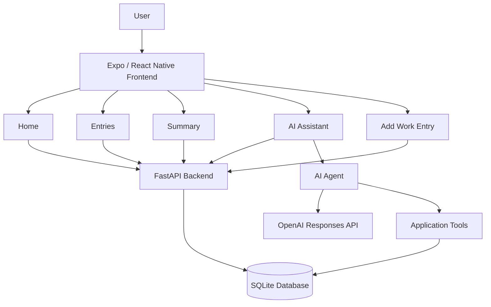

# Work Hour Tracker

A full-stack work-hours and earnings tracking application built with **React Native / Expo**, **FastAPI**, **SQLite**, and an **OpenAI-powered AI assistant**.

Work Hour Tracker allows users to record working hours and hourly rates, review their work history, generate earnings summaries for a date range, and interact with an AI assistant that can work with their records through application tools.

> **Project status:** Functional MVP / portfolio project. Core functionality has been implemented and tested across web and Android, including work-entry management, summaries, database integration, and AI-assisted record management.

---

## Overview

Tracking work hours manually can make it difficult to calculate earnings, review historical records, and quickly answer questions about work performed over a period of time.

Work Hour Tracker provides a simple interface for:

- Recording work hours and hourly pay rates
- Viewing saved work entries
- Calculating total hours and earnings over a selected date range
- Asking an AI assistant questions about work records
- Allowing the AI assistant to perform supported record-management operations

The application is designed as a practical demonstration of full-stack application development, API design, database integration, mobile/web development, and AI tool calling.

---

## Key Features

### Work Entry Management

- Add a work entry with:
  - Work date
  - Hours worked
  - Hourly rate
- Validate hours and hourly rate before submission
- Store records in a SQLite database
- Prevent duplicate entries for the same date under the current data model
- Update an existing entry by date
- Display confirmation after a successful save
- Return the user to the Home screen after saving

### Work History

- Retrieve all saved work entries
- Display hours worked, hourly rate, and calculated earnings for each entry
- Scroll through work history on mobile

### Earnings Summary

- Select a start date and end date
- Calculate:
  - Total hours worked
  - Total earnings
- Validate that the start date is not after the end date
- Display calculated values to two decimal places

### Dynamic Home Dashboard

The Home screen retrieves actual work records from the backend and displays:

- Hours worked today
- Earnings today
- Most recent work entries

The dashboard therefore reflects stored application data rather than static demonstration values.

### AI Assistant

The application includes an AI assistant connected to the backend.

The assistant can:

- Answer ordinary conversational messages
- Retrieve all work records
- Retrieve a specific record by date
- Generate summaries for date ranges
- Save work entries
- Update existing work entries
- Interpret relative dates such as "today," "yesterday," "this month," and "last month"

The AI assistant uses function/tool calling to connect natural-language requests with application functionality.

For example:

> "How many hours did I work this month?"

or:

> "Record 8 hours today at $15 per hour."

The assistant interprets the request and uses the appropriate backend operation when work-record data is required.

---

## Application Architecture



### Standard Request Flow

```text
User
  ↓
Expo / React Native UI
  ↓
Frontend API Service
  ↓
FastAPI Endpoint
  ↓
Service Layer
  ↓
SQLite Database
```

### AI Request Flow

```text
User
  ↓
AI Assistant UI
  ↓
POST /agent
  ↓
AI Agent
  ↓
OpenAI model
  ↓
Tool selection
  ↓
Application service
  ↓
SQLite Database
  ↓
Tool result
  ↓
AI-generated response
  ↓
User
```

---

## Technology Stack

### Frontend

- **React Native**
- **Expo**
- **Expo Router**
- **TypeScript**
- **React Navigation**
- **@react-native-community/datetimepicker**

The frontend supports both native navigation and a web-specific tab interface.

### Backend

- **Python**
- **FastAPI**
- **Uvicorn**
- **Pydantic**
- **SQLite**

### Artificial Intelligence

- **OpenAI API**
- **Responses API**
- **Function/tool calling**
- **GPT-4o-mini**

### Database

- **SQLite**

The current database contains a `work_entries` table with:

| Column         | Type    | Description                 |
| -------------- | ------- | --------------------------- |
| `id`           | INTEGER | Primary key                 |
| `date`         | TEXT    | Date the work was performed |
| `hours_worked` | REAL    | Number of hours worked      |
| `hourly_rate`  | REAL    | Hourly pay rate             |

---

## Project Structure

```text
work-hour-tracker/
│
├── backend/
│   └── app/
│       ├── ai.py
│       ├── config.py
│       ├── database.py
│       ├── main.py
│       ├── models.py
│       ├── schemas.py
│       ├── tools.py
│       │
│       ├── services/
│       │   └── entry.py
│       │
│       └── tests/
│           ├── test_agent.py
│           ├── test_db.py
│           ├── test_insert.py
│           ├── test_retrieve.py
│           └── test_tables.py
│
├── frontend/
│   ├── .env.example
│   │
│   ├── src/
│   │   ├── app/
│   │   │   ├── (tabs)/
│   │   │   │   ├── index.tsx
│   │   │   │   ├── entries.tsx
│   │   │   │   ├── summary.tsx
│   │   │   │   ├── assistant.tsx
│   │   │   │   └── _layout.tsx
│   │   │   │
│   │   │   ├── add-entry.tsx
│   │   │   └── _layout.tsx
│   │   │
│   │   ├── components/
│   │   ├── constants/
│   │   ├── hooks/
│   │   └── services/
│   │       └── api.ts
│   │
│   ├── app.json
│   ├── package.json
│   └── tsconfig.json
│
├── requirements.txt
├── .gitignore
├── LICENSE
└── README.md
```

---

# Getting Started

## Prerequisites

Before running the application locally, install:

- Python 3.12+
- Node.js and npm
- Expo-compatible development environment
- An OpenAI API key for AI assistant functionality

---

## 1. Clone the Repository

```bash
git clone https://github.com/Emmanuel-K0ech/work-hour-tracker.git
cd work-hour-tracker
```

---

## 2. Backend Setup

Create and activate a Python virtual environment.

### Linux / macOS

```bash
python3 -m venv venv
source venv/bin/activate
```

### Windows

```powershell
python -m venv venv
venv\Scripts\activate
```

Install the backend dependencies:

```bash
pip install -r requirements.txt
```

The requirements include the OpenAI Python SDK and `python-dotenv`, which are required by the AI assistant and environment configuration.

### Configure the OpenAI API Key

Create:

```text
backend/app/.env
```

Add:

```env
OPENAI_API_KEY=your_api_key_here
```

**Never commit this file or your actual API key to GitHub.**

The project's `.gitignore` excludes `.env` files from version control.

### Start FastAPI

From the project root:

```bash
cd backend
uvicorn app.main:app --reload --host 0.0.0.0 --port 8000
```

The API will normally be available locally at:

```text
http://localhost:8000
```

FastAPI's interactive API documentation is available at:

```text
http://localhost:8000/docs
```

Using `--host 0.0.0.0` allows FastAPI to accept connections from other reachable devices during local development.

---

## 3. Frontend Setup

Open another terminal:

```bash
cd frontend
```

Install the JavaScript dependencies:

```bash
npm install
```

### Configure the Backend URL

The frontend uses the `EXPO_PUBLIC_API_URL` environment variable to determine the FastAPI backend address.

An example configuration is provided in:

```text
frontend/.env.example
```

Create your local environment configuration:

```bash
cp .env.example .env
```

The default configuration is:

```env
EXPO_PUBLIC_API_URL=http://localhost:8000
```

The frontend also falls back to:

```text
http://localhost:8000
```

when `EXPO_PUBLIC_API_URL` is not defined.

The local `.env` file is excluded from Git and should not be committed.

### Start Expo

```bash
npx expo start
```

### Run on the Web

```bash
npx expo start --web
```

### Run with Expo Go

If the development device has difficulty connecting directly to the Expo development server, Expo's tunnel mode can be used:

```bash
npx expo start --tunnel
```

Scan the displayed QR code with Expo Go.

### Android Development Build / Emulator

```bash
npx expo start --android
```

### iOS Development Build / Simulator

```bash
npx expo start --ios
```

The native commands require the appropriate Android or iOS development environment.

---

## Testing on a Physical Device

When the application runs on a physical phone, `localhost` refers to the phone itself rather than the computer running FastAPI.

Set the frontend environment variable to an address through which the phone can reach the development computer:

```env
EXPO_PUBLIC_API_URL=http://YOUR_COMPUTER_IP:8000
```

The phone and development computer must be able to communicate over the network.

Depending on the development environment, additional network configuration may be required to make a backend running inside a virtualized environment such as WSL reachable from another device.

The project does not commit machine-specific IP addresses.

---

# API Documentation

FastAPI provides interactive API documentation at `/docs` while the backend is running.

The application uses endpoints for the following operations.

## Create Work Entry

```http
POST /entries
```

Example request:

```json
{
  "date": "2026-09-02",
  "hours_worked": 8,
  "hourly_rate": 15
}
```

---

## Retrieve All Entries

```http
GET /entries
```

Returns the saved work entries.

---

## Retrieve an Entry by Date

```http
GET /entries/{date}
```

Example:

```http
GET /entries/2026-09-02
```

---

## Generate Work Summary

```http
GET /summary?start_date=YYYY-MM-DD&end_date=YYYY-MM-DD
```

Example:

```http
GET /summary?start_date=2026-09-01&end_date=2026-09-30
```

The response includes total hours and total earnings for the selected period.

---

## Update an Entry

```http
PUT /entries/{date}
```

Updates an existing work entry identified by its date.

Example:

```http
PUT /entries/2026-09-02
```

Request body:

```json
{
  "hours_worked": 10,
  "hourly_rate": 15
}
```

The date is provided in the URL, while the updated hours worked and hourly rate are provided in the request body.

---

## AI Assistant

```http
POST /agent
```

Example request:

```json
{
  "message": "How many hours did I work this month?"
}
```

The endpoint sends the request to the AI agent, which determines whether an application tool is required.

---

# AI Assistant Architecture

The AI assistant is implemented on the backend rather than calling OpenAI directly from the frontend.

This keeps the OpenAI API key on the server and allows the application to control which operations the model can perform.

The currently available tools are:

| Tool           | Purpose                                       |
| -------------- | --------------------------------------------- |
| `save_entry`   | Save a new work entry                         |
| `get_entries`  | Retrieve all work entries                     |
| `get_entry`    | Retrieve an entry by date                     |
| `update_entry` | Update an existing entry                      |
| `get_summary`  | Calculate hours and earnings for a date range |

### Tool Calling Flow

```text
1. User sends a natural-language request
                ↓
2. Backend sends request to OpenAI
                ↓
3. Model determines whether a tool is required
                ↓
4. Backend extracts the requested tool and arguments
                ↓
5. Backend executes the application function
                ↓
6. Tool result is returned to the AI
                ↓
7. AI generates a natural-language response
                ↓
8. Response is returned to the frontend
```

This architecture demonstrates an important pattern for AI-enabled applications: the model handles language understanding while the application remains responsible for executing operations against its data.

The AI is instructed to use application tools for factual work-record questions rather than inventing database information.

---

# Database

The application currently uses SQLite for local persistence.

The database is created automatically when the backend initializes the application.

The work-entry data model contains:

```text
id
date
hours_worked
hourly_rate
```

### Current Data Model Limitation

The current application prevents more than one work entry from being saved for the same date.

This means the application currently models:

```text
One date → One work entry
```

A future version may change this to:

```text
One date → Multiple work entries
```

This would support scenarios such as multiple shifts in one day or different hourly rates during the same day.

The local SQLite database (`*.db`) is excluded from version control.

---

# Testing

The repository includes backend test scripts covering areas such as:

- Database initialization
- Table creation
- Database insertion
- Record retrieval
- AI agent behavior

The test files are located under:

```text
backend/app/tests/
```

The application has also been manually tested across its primary user flows.

### Tested Application Flows

- Creating a work entry
- Retrieving saved entries
- Scrolling through work history on Android
- Generating date-range summaries
- Displaying real database values on the Home dashboard
- Post-save confirmation and navigation
- Mobile tab navigation
- Retrieving records through the AI assistant
- Generating summaries through the AI assistant
- Updating records through the AI assistant
- Running the application on a physical Android device with Expo Go

Current automated tests are primarily lightweight Python scripts and should be expanded into a formal automated test suite before production deployment.

A future testing setup should include:

- `pytest`
- API endpoint tests
- Database service tests
- AI tool-calling tests
- Frontend component tests
- End-to-end tests

---

# Security Considerations

This project is currently designed for local development and portfolio demonstration.

Before production deployment, the following should be addressed.

### API Key Protection

Never commit:

```text
.env
```

or an actual OpenAI API key.

The OpenAI API key remains exclusively on the backend.

### Local Database Protection

SQLite database files are excluded from version control using:

```text
*.db
```

This prevents local work records from being accidentally committed to the repository.

### CORS

The backend currently uses broad CORS configuration for development.

Production deployment should restrict allowed origins to trusted frontend origins.

### Input Validation

The application performs client-side and backend request validation. Additional production validation could enforce stricter constraints such as:

- Reasonable maximum working hours
- Reasonable hourly-rate ranges
- Additional date constraints

### Database

SQLite is appropriate for the current local MVP.

A production application should consider a managed relational database and proper user isolation if multiple users are supported.

### Authentication

The current application does not implement user authentication or authorization.

Before supporting multiple users, authentication and authorization should be added so users can access only their own records.

---

# Known Limitations

The current MVP has several areas intentionally left for future development:

- No user authentication
- SQLite is intended primarily for local development
- One work entry per date is currently supported
- No delete-entry functionality
- Entries cannot currently be edited through a dedicated frontend edit form
- Limited formal automated testing
- AI tool-calling behavior can be further hardened
- Production deployment configuration has not yet been implemented
- CORS is configured broadly for development
- No dedicated production error-monitoring system

---

# Roadmap

## Phase 1 — MVP

- [x] Create work entries
- [x] View work entries
- [x] Generate date-range summaries
- [x] Update entries
- [x] AI assistant
- [x] AI tool calling
- [x] Web support
- [x] Native Expo support

## Phase 2 — Application Improvements

- [x] Dynamic Home dashboard
- [x] Environment-based frontend API configuration
- [x] Mobile navigation
- [x] Physical-device testing
- [x] Post-save confirmation and navigation
- [ ] Delete entries
- [ ] Edit entries from the frontend
- [ ] Support multiple entries per day
- [ ] Improve empty states
- [ ] Improve loading states
- [ ] Improve error handling
- [ ] Add stronger backend validation

## Phase 3 — Production Readiness

- [ ] User authentication
- [ ] User-specific data isolation
- [ ] Production database
- [ ] Restricted CORS
- [ ] Formal automated testing
- [ ] CI/CD pipeline
- [ ] Production deployment
- [ ] Monitoring and logging

## Phase 4 — Advanced Features

- [ ] Monthly and weekly analytics
- [ ] Earnings charts
- [ ] Overtime calculations
- [ ] Custom pay periods
- [ ] Export to CSV/PDF
- [ ] AI-powered analytics
- [ ] Notifications and reminders

---

# Screenshots

Screenshots can be added as the interface is finalized.

Recommended structure:

```text
docs/
└── screenshots/
    ├── home.png
    ├── add-entry.png
    ├── entries.png
    ├── summary.png
    └── assistant.png
```

They can then be displayed in this README using:

```markdown


```

---

# Development Notes

The project intentionally separates the frontend, backend, database, and AI logic.

### Frontend

The Expo application is responsible for:

- User interface
- Navigation
- Form handling
- Client-side validation
- API communication
- Displaying backend responses

### Backend

FastAPI is responsible for:

- HTTP API endpoints
- Request validation
- Database interaction through the service layer
- AI agent orchestration

### Service Layer

`backend/app/services/entry.py` contains the main work-entry operations.

This separation keeps database operations out of the route definitions and makes the backend easier to extend and test.

### AI Layer

`backend/app/ai.py` handles:

- Communication with OpenAI
- Tool-call extraction
- Tool argument parsing
- Tool execution
- Generating the final natural-language response

### Tool Definitions

`backend/app/tools.py` defines the operations that the AI model is allowed to request.

The current AI scope intentionally uses the application's existing work-entry operations rather than introducing a separate data-management system.

---

# Contributing

This repository is primarily a personal portfolio and learning project, but suggestions and improvements are welcome.

To contribute:

1. Fork the repository.
2. Create a feature branch.
3. Make your changes.
4. Test the changes locally.
5. Commit your changes with a descriptive message.
6. Open a pull request.

---

# License

This project is licensed under the MIT License.

See the [LICENSE](LICENSE) file for details.

---

# Author

**Emmanuel Kipchumba Koech**

Computer Science / Information Systems | Software Development | Cybersecurity

GitHub: `Emmanuel-K0ech`

---

## Project Purpose

Work Hour Tracker was built as a practical full-stack project to explore the integration of:

- Mobile and web application development
- REST API design
- Database persistence
- AI-assisted application workflows
- Function/tool calling
- Backend service architecture
- Cross-platform development with Expo

The project demonstrates how a conventional work-tracking application can be extended with an AI interface that allows users to interact with application data using natural language while keeping actual data operations under application control.
